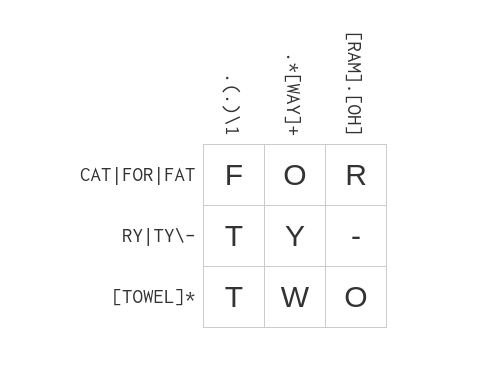

The following are solutions from the REGEX tutorial [regexcrosswords](https://regexcrossword.com/).

### Beginner

#### (1) beatles

Hint: 
- `[^SPEAK]` means any character <b>NOT</b> present in list.

#### (2) naughty

Hint: 

- In the pattern `.*M?O.*`, an `O` <b>must</b> be present for a match to happen.

- `\1` makes back reference to match same text of the first group again.

#### (3) ghost

#### (4) symbolism

Hint:

- `[*]` Matches the `*` character literally.

#### (5) airstrip one

### Intermediate

#### (1) always remember

#### (2) johnny

#### (3) earth

Hint: 

- In `.(.)\1`, the `\1` references the first group captured. In this case, `.(.)\1` means the letter captured is repeated.

#### (4) encyclopedia

.

#### (5) technology

### Experienced

#### (1) royal dinner

#### (2) regular workout

#### (3) We apologise for the inconvenience

#### (4) Questionable

#### 5) Hamlet

Hint:

- `{2}` quantifier matches `T` exactly 2 times.